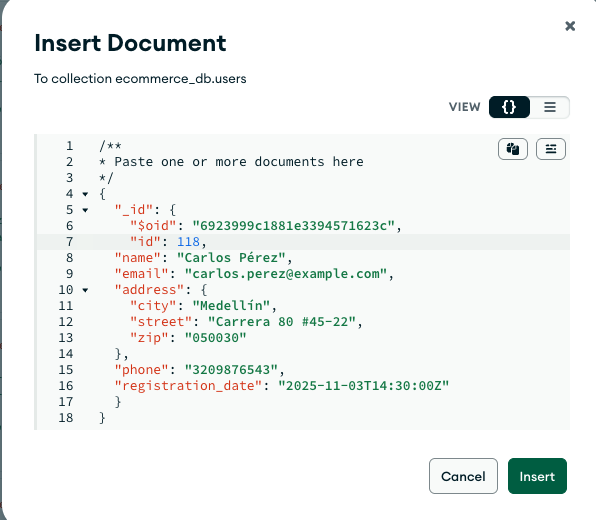

# Proyecto: Consultas MongoDB – Base de Datos Ecommerce

Este documento contiene todas las consultas realizadas sobre la base de datos **ecommerce_db**, incluyendo:

- Inserciones
- Selecciones
- Actualizaciones
- Eliminaciones
- Consultas con filtros y operadores
- Consultas de agregación
- Análisis de resultados

---

#  1. Estructura de la Base de Datos

| Colección   | Descripción | Campos principales |
|-------------|-------------|-------------------|
| users       | Usuarios registrados | id, name, email, address { city, street, zip }, phone, registration_date |
| products    | Catálogo de productos | name, category_id, price, stock, description, specifications, created_at |
| categories  | Clasificación de productos | name, description |
| orders      | Pedidos realizados | user_id, order_date, items { product_id, quantity, subtotal }, total, status |
| reviews     | Reseñas de productos | product_id, user_id, rating, comment, date |

---

# 2. Consultas Básicas

### Insertar un usuario
```js
{
  "_id": "6918e1a3b4f91f569a99db10",
  "id": 118,
  "name": "Carlos Pérez",
  "email": "carlos.perez@example.com",
  "address": {
    "city": "Medellín",
    "street": "Carrera 80 #45-22",
    "zip": "050030"
  },
  "phone": "3209876543",
  "registration_date": "2025-11-03T14:30:00Z"
}
```


### Selección de un producto
```js
{ name: "Smartphone Samsung Galaxy S24" }
```

### Actualizatión de un usuario
```js
db.users.updateMany(
  { id: 16 },      
  {
    $set: {       
      phone: "3007987767"
    }
  },
  {
    upsert: false,  
    writeConcern: { w: 1 }
  }
)
```

### Eliminación de una orden
```js
db.orders.deleteOne(
  { id: 150 },         
  {
    writeConcern: { w: 1 }
  }
)
```

# 3. Consultas de con filtros y operadores

### Usuarios con mas de 1 pedido
```js
db.orders.aggregate([
  { $group: { _id: "$user_id", total_pedidos: { $sum: 1 } } },
  { $match: { total_pedidos: { $gt: 1 } } }
])
```
Lista los usuararios con mas de 1 pedido 

### Productos con menor o igual a 5 en existencia
```js
db.products.find({ stock: { $lte: 5 } })
```
Lista los productos con un valor menor o igual a 5 en existencia. 

### Productos con precio mayor a 200.000
```js
db.products.find({ price: { $gt: 200000 } })
```

# 4. Consultas de con filtros y operadores

### Contar usuarios registrados
```js
db.users.aggregate([
  { $count: "total_usuarios" }
])
```
Esta consulta usa $count para devolver cuántos documentos existen en la colección users. Es útil para estadísticas generales del sistema.

### Total de ventas generadas
```js
db.orders.aggregate([
  { $group: { _id: null, total_ventas: { $sum: "$total" } } }
])
```
Agrupa todos los pedidos y suma el campo total.
El resultado muestra cuánto dinero ha generado la tienda en ventas.

### Cantidad de productos por categoría
```js
db.products.aggregate([
  { $group: { _id: "$category_id", productos: { $sum: 1 } } }
])
```
Agrupa los productos por categoría y cuenta cuántos hay en cada una.
Es útil para inventarios y clasificación.